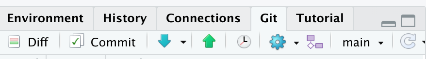

# Who I am

- PhD in Economics from the University of Ottawa

- Currently a Postdoc at uOttawa and Part-time professor
  - I teach econometrics (McGill) and data science (uOttawa)

- Environmental economist
  - applied work
  - machine learning
  
# The tools I am using

- My first language was Stata
  - Stata is terrific language and extremely capable
  - It is limited by its proprietary nature

\bigskip
- When I started the research part of my PhD I dived into Python and R
  - I needed Python to handle weather data
  - I also discovered the many capabilities of R

\bigskip 
- Today my preferred language is:
  - Python for machine learning
  - R for presentation, website, Github
  - Stata and R for causal inference regressions
  
# Motivation
- Data science is a portmanteau word which covers many disciplines

- The tools used in data science are generally derived from the needs of developers and people using data in production

- This means that not all tools will correspond to our needs
  - We rarely receive new data everyday that we need to ingest
  
- But some of these tools can be very useful to us
  
# Motivation

 ](./figures/data_science_workflow.png)

# Open source

- Unlike Stata, R, Python, Google Colab, Github etc. are open source (or at least free)
  - Although for Github when services are free you may be the product
  
- What makes open source so great is that it offers:
  - great modularity
  - complementarities
  - community support
  
# (Open) Sources

- For today I was inspired by:
  - [Grant McDermott](https://github.com/uo-ec607/lectures) from University of Oregon
  - Free Code Camp [Git and GitHub for Beginners](https://www.youtube.com/watch?v=RGOj5yH7evk&t=8s&ab_channel=freeCodeCamp.org)
  - [Hadley Wickham](https://r-pkgs.org/git.html#commit-best-practices)
  
- All these resources are available for free

- I'm happy to point you towards more resources if you want
  
# The tools - Version control
- We may not use new data every day but we are revisiting our scripts often

- sometimes months pass before we go back to them

- sometimes researchers come in and out of projects

# The tools - Dynamic Documents 

- Code does not have to be detached from text, equations, or the tables and figures it produces

- Being able to bring everything in a single document can be very efficient

- Jupyter and R-markdown works both with Python, R or even Stata

- You can do many things with them including this presentation or personal websites!

# The tools - Unit testing
- Code always does exactly what it is told to do

- It's not always the same thing as what want it to do

- The need to publish data along with papers makes the need for robust code even greater

# Looks familiar?

\centering
\includegraphics[height=.8\textheight]{./figures/messy_code.png}

# Git to the rescue

- Git is one of the tools one can use to do version control

- It is a way to store information and keep track of modifications in your code

- Paying the fixed cost of learning this tool can prove a very good investment

# GitHub

- You can think of Github as being built on top of Git
  
- There are other competitors (Bitbucket, Gitlab...)

- One can absolutely use Git without having access to Github but the latter offers nice additional features


# Github for economists

### From software development...

Git and GitHub play a major role in software development 

### ... to scientific research
- Of course version control helps for organizing your code and work colaboratively

- It is also a key component of open science and reproducibility

- Journals have increasingly strict requirements regarding reproducibility and data access. 

# Github

**What is Github?**
https://github.com/


# Github desktop

**What is Github desktop?**
https://docs.github.com/en/desktop/contributing-and-collaborating-using-github-desktop


# Github lingo - Repository

- A __repository__ is usually used to organize a single project.

- Repositories can contain folders and files, images, videos, spreadsheets, and data sets – anything your project needs.

- Usually it includes a README and you can provide a license file.

# How to create a new repository

- In the upper right corner, next to your avatar or identicon, click  and then select New repository.

- Give a name to your new repository 

- Write a short description

- Select Initialize this repository with a README

# Github lingo - Main and branches

- By default your repository has one branch named __main__

- You should think of main as your best current version

- If you want to edit your code but don't want to lose what you have so far you can create a new branch

- When you create a branch off the main branch you are making a copy of main

- You use branches to experiment and make edits before committing them to main

# Branching


# Github lingo - Commits

- On GitHub, saved changes are called __commits__ 

- Each commit has an associated commit message
  - a description explaining why a particular change was made
  - commit messages capture the history of your changes
  - other contributors can understand what you have done and why.

# Github lingo - Pull request

- __Pull Requests__ are the heart of collaboration on GitHub. 

- When you open a pull request, you’re proposing your changes and requesting that someone review and pull in your contribution and merge them into their branch.

- Pull requests show diffs, or differences, of the content from both branches. 

- The changes, additions, and subtractions are shown in green and red.

# Github lingo - Pull request

- As soon as you make a commit, you can open a pull request and start a discussion, even before the code is finished.

- By using GitHub’s @mention system in your pull request message, you can ask for feedback from specific people or teams, whether they’re down the hall or 10 time zones away.

- You can even open pull requests in your own repository and merge them yourself. It’s a great way to learn the GitHub flow before working on larger projects.

# Exercice 1 - Create a repo

- Create a new repository:
  - Go on your [Github page](https://github.com/) and click on the gree button "New"
  - call this new repository repo-mont2
  - Select: Add a README file
  - Click on Create repository at the bottom
  
# Exercice - Import locally 
- Go on your Github desktop app
- At the top left use the drop down arrow
- Select:
  - Add
  - Clone repository...
  - URL
- Enter the URL of your Github project
  - For instance mine is : https://github.com/forgef/repo-mont2
- At the bottom click on Choose...
  - Locate where you want to put the files
  - Give a name to the folder like repo-mont2
  
# Exercice - Modify and Commit
- Locate your README.md file
- This is a markdown file which you can edit from any texteditor (including Latex)
- Go back to your Github desktop app
  - You should now see the changes that were made to your README
- At the bottom left of the app there is a box for you to fill out in which you __must__ describe the modifications that you made
  - In sumary type: my first commit
  - In description type: I changed the README using the text editor XXX
- Then click on commit to main

# Exercice - Push
- At the top of the Github app you have a Push origin button

- Click on it

- Go back to your Github page

- Refresh your screen

# Exercice - History
- Above your README file you have the list of the files in your repository and commit messages
  - of course at this stage you only have

- Click on the history button (to the right)  


- You can now see the history of the versions of this file
  - the initial and the one you edited
  
- Go back to the Github desktop app
  - At the top left select history
  - You can also see the old version

# Exerice - Changes on line

- You can now go back to the Github website.

- Locate the edit button (looks like a pencil)

- Edit the README file directly online:

- At the bottom of the README file add "Hello again this is my second edit to my first repository"

- Scroll down to Commit Changes
  - Enter: "my second edit"
  - click on commit
  
# Exercice - Create a new branch

- On Github, create a branch called "my-edits"

- On Github desktop app click on fetch origin

- Edit the README file and add "test" at the bottom

- Commit your changes (make sure to be in "my-edits" not "main")

- Create a pull your request

# Exercice - Merge to main

- From Github go on the pull request tab

- Accept the pull request 


# Intregration with RStudio

- RStudio is a tremendous IDE that integrates version control with Github very easily

- Let's set it up together

# Create a new R project with version control

- Let's create a second repository in Github
  - name it repo-rstudio
  - copy the URL

- Then use File > New Project... > Version Control > Git 
  - Enter the URL
  - Select in which folder to put it
  
- Create

# Edits

- The bottom right panel now shows the README file

- You can open it by clicking on it

- You can edit the file by adding some text and save it

- Now look at the top right panel and the Git tab
  - README should appear with an M status
  - Your file was modified

# Exercice: Stage, Commit, Pull and Push
**Stage**

  - Tell Git that you want to add changes to the repo history (file edits, additions, deletions, etc.)

**Commit**

  - Tell Git that, yes, you are sure these changes should be part of the repo history.
  
**Pull** 
  - Just in case anyone else made changes too (or as a safeguard before commiting to main)

**Push**

  - Push committed local changes to the GitHub repo
  
  

# Integration with Python

- The integration with Python is not as good as with RStudio

- This is in part because Python is used on many different IDEs

- If you use Jupyter or Jupyterlab you can install a git extension:
  - https://github.com/jupyterlab/jupyterlab-git
  
- Let's use the Geemap repository: https://github.com/giswqs/geemap

# Exercice
- Go on [Kaggle's](https://www.kaggle.com/) Github page
https://github.com/abhinavsagar/kaggle-notebooks

- Copy the URL 

- Go to Google Colab

- Create a new Notebook from Github (pick any from the list)

- Save the Notebook to your own repository using 

# Github using the shell - Clone

- You can __clone__ a repository

- Open your terminal/command prompt
  - Mac: COMMAND+SPACE > Terminal
  - PC: Windows+R to open “Run” box. Type “cmd” and then click “OK”
  
- Set current directory to a new folder
```bash
$ cd PATH-TO-YOUR-FOLDER
```

- Create new folder

```bash
$ mkdir NAME-FOLDER
```

- Clone repo

```bash
$ git clone REPOSITORY-URL  NAME-FOLDER
```

# Main Git shell commands

Clone a repo.
```bash
$ git clone REPOSITORY-URL 
```

See the commit history (hit spacebar to scroll down or q to exit).
```bash
$ git log
```

What has changed? 
```bash
$ git status
```
---

# Main Git shell commands (cont.)

Stage ("add") a file or group of files.
```bash
$ git add NAME-OF-FILE-OR-FOLDER
```

- Stage all files.
```bash
$ git add -A
```
- Stage updated files only (modified or deleted, but not new).
```bash
$ git add -u
```
- Stage new files only (not updated).
```bash
$ git add .
```

---

# Main Git shell commands (cont.)

Commit your changes.
```bash
$ git commit -m "Helpful message"
```

Pull from the upstream repository (i.e. GitHub).
```bash
$ git pull
```

Push any local changes that you've committed to the upstream repo (i.e. GitHub).
```bash
$ git push
```


# Exercice - Collaboration

Turn to the person next to you. You are now partners. (Congratulations.)

- P1: Invite P2 to join you as a collaborator on the "test" GitHub repo that you created earlier. (See the *Settings* tab of your repo.)

- P2: Clone P1's repo to your local machine in a new directory

  - Make some edits to the README (e.g. delete lines of text and add your own). 
  - Stage, commit and push these changes.

- P1: 
  - Make your own changes to the README on your local machine. 
  - Stage, commit and then try to push them (**after** pulling from the GitHub repo first).


# Exercice - Merge Conflicts

- P1 should have encountered a `merge conflict` error

- Confirm the error using
```bash
$ git status
```

- You should see
```bash
Unmerged paths:
  (use "git add <file>..." to mark resolution)
   * both modified:   README.md 
```
- Git is protecting P1 by refusing the merge

- It wants to make sure that you don't accidentally overwrite all of your changes by pulling P2's version of the README.


# Exercice - Merge conflicts (cont.)

- Open the README file in RStudio 

- You should see something like:
```bash
# README
Some text here.
<<<<<<< HEAD
Text added by Partner 2.
=======
Text added by Partner 1.
>>>>>>> 814e09178910383c128045ce67a58c9c1df3f558.
More text here.
```


# Merge conflicts (cont.)

What do these symbols mean?

```bash
# README
Some text here.
<<<<<<< HEAD
Text added by Partner 2.
=======
Text added by Partner 1.
*>>>>>>> 814e09178910383c128045ce67a58c9c1df3f558.
More text here.
```

- `<<<<<<< HEAD` Indicates the start of the merge conflict.
- `=======` Indicates the break point used for comparison.
- `>>>>>>> <long string>` Indicates the end of the lines that had a merge conflict.

---

# Exercice - Merge conflicts (cont.)

- P1 Delete the lines of the text that you don't want.

- Then, delete the special Git merge conflict symbols.

- Commit, pull and finally push your changes to the GitHub repo without any errors


# Create a new branch in RStudio


- Click on the purple button

- Name the new branch

- Note that you can even branch a branch


# Branch shell commands

Create a new branch on your local machine and switch to it:
```bash
$ git checkout -b NAME-OF-YOUR-NEW-BRANCH
```

Push the new branch to GitHub:
```bash
$ git push origin NAME-OF-YOUR-NEW-BRANCH
```

List all branches on your local machine:
```bash
$ git branch
```

Switch back to (e.g.) the master branch:
```bash
$ git checkout master
```

Delete a branch
```bash
$ git branch -d NAME-OF-YOUR-FAILED-BRANCH
$ git push origin :NAME-OF-YOUR-FAILED-BRANCH
```

---

# Merging branches + Pull requests

You have two options:

__1. Locally__
- Commit your final changes to the new branch (say we call it "new-idea").
- Switch back to the master branch: `$ git checkout master`
- Merge in the new-idea branch changes: `$ git merge new-idea`
- Delete the new-idea branch (optional): `$ git branch -d new-idea`

# Merging branches + Pull requests  
__2. Remotely (i.e. *pull requests* on GitHub)__
- PRs are a way to notify collaborators — or yourself! — that you have completed a feature.
- You write a summary of all the changes contained in the branch.
- You then assign suggested reviewers of your code — including yourself potentially — who are then able to approve these changes ("Merge pull request") on GitHub.
- Let's practice this now in class...


# Pull request

You know that "new-idea" branch we just created a few slides back? Switch over to it if you haven't already.
- Remember: `$ git checkout new-idea` (or just click on the branches tab in RStudio)

Make some local changes and then commit + push them to GitHub.
- The changes themselves don't really matter. Add text to the README, add some new files, whatever.

# Pull request
After pushing these changes, head over to your repo on GitHub.

- You should see a new green button with "Compare & pull request". Click it.

- Add a meta description of what this PR accomplishes. You can also change the title if you want.

- Click "[Create pull request]("https://help.github.com/articles/creating-a-pull-request/")".

- Once satisfied, click "Merge pull request" and then confirm.


# Forks

- Git __forks__ lie somewhere between cloning a repo and branching from it.
  - A fork is an independent copy of the repository as it is now

- To [fork](https://help.github.com/articles/fork-a-repo/) a project, go on the repos page and click on "Fork"

- This will create an independent copy of the repo under your GitHub account.

- Go to [my repo](https://github.com/forgef/Data-Science-Tools-Workshop) for these workshops and fork it

- You can still pull a request to the original repo from your forked version
  - Edit some code and then [issue an upstream pull request](https://help.github.com/articles/creating-a-pull-request-from-a-fork/).
  
- The author of the original repo is notified and can then decide whether to merge the contribution

---

# Forks (cont.)

- Keeping your fork up to date with the original repo requires some work

- We will see how to "[Sync a fork](https://help.github.com/articles/syncing-a-fork/)" when we want to add the next workshop next week

- If the end goal is to publish reproducible code for your published paper then this won't be an issue


# More about README

- README as repo landing pages

- Markdown files and syntax are actually that used by the notebooks we will see next week

- It means I was able to give some more information thant just the name of the repo

- For a paper you could for instance give there a summary of your paper with the main figures and results


---

# .gitignore

- A __.gitignore file__ tells Git what ignore.

- You can exclude whole folders such as your data folder
  - Note that Github [does not allow files larger than 100MB]("https://help.github.com/articles/working-with-large-files/")

- You should therefore put your dataset folder under .gitignore


# .gitignore (cont.)

You can create a .gitignore file in multiple ways.

- A .gitignore file was automatically generated if you cloned your repo with an RStudio Project.
- You could also have the option of adding one when you first create a repo on GitHub.
- Or, you can create one with your preferred text editor. (Must be saved as ".gitignore".)

Once the .gitignore file is created, simply add in lines of text corresponding to the files that should be ignored.

# .gitignore (cont.)
- To ignore a single a file: `FILE-I-WANT-TO-IGNORE.csv`
- To ignore a whole folder (and all of its contents, subfolders, etc.): `FOLDER-NAME/**`
- The standard shell commands and special characters apply.
  - E.g. Ignore all CSV files in the repo: `*.csv`
  - E.g. Ignore all files beginning with "test": `test*`
  - E.g. Don't ignore a  particular file: `!somefile.txt`


# GitHub Issues

- [GitHub Issues](https://guides.github.com/features/issues/) are another way to interact with your collaborators

- For instance, since now you forked this repo and you spot a mistake you could create an issue asking me to fix it
  


# Recipe (shell commands in grey)

1. Create a repo on GitHub and initialize with a README.

2. Clone the repo to your local machine. Preferably using an RStudio Project, but as you wish. (E.g. Shell command: `$ git clone REPOSITORY-URL`)

3. Stage any changes you make: `$ git add -A`

4. Commit your changes: `$ git commit -m "Helpful message"`

5. Pull from GitHub: `$ git pull`

6. (Fix any merge conflicts.)

7. Push your changes to GitHub: `$ git push`

--

Repeat steps 3—7 (but especially steps 3 and 4) often.


# FAQ

**Q: Where can I find more**

- A lot here comes from [Grant McDermott](https://github.com/uo-ec510-2020-spring/lectures)

- There are free online books for seamless integration with Rstudio
  - Just Google RStudio Github
  
- The more complicated features of Github are not really useful to us

# FAQ

**Q: When should I commit (and push) changes?**

**A: Early and often.**
- It's not quite as important as saving your work regularly, but it's a close second.
- You should certainly push everything that you want your collaborators to see.
  
**Q: Do I need branches if I am working on a solo project?**

**A: You don't *need* them, but they offer big advantages in maintaining a sane workflow.**
- Experiment without any risk to the main project!
- If you combine them with pull requests, then you can compress significant additions to your project (which may comprise many small edits) into a single branch.

---

# FAQ (cont.)

**Q: What's the difference between cloning and forking a repo?**

**A: Cloning directly ties your local version to the original repo, while forking creates a copy on your GitHub (which you can then clone).**
- <a href="http://happygitwithr.com/clone.html" target="_blank">Cloning</a> makes it easier to fetch updates (and is often the best choice for new GitHub users), but <a href="http://happygitwithr.com/fork.html" target="_blank">forking</a> has advantages too.

**Q: What happens when something goes wrong?**

**A: Think: "Oh shit, Git!"**
- Seriously: http://ohshitgit.com/.
  
**Q: What happens when something goes <i>horribly</i> wrong?**

**A: Burn it down and start again.**
- http://happygitwithr.com/burn.html
- This is a great advantage of Git's distributed nature. If something goes horribly wrong, there's usually an intact version somewhere else.
  


