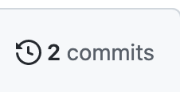
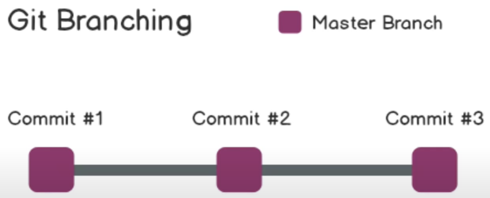

# Who I am

- PhD in Economics from the University of Ottawa

- Currently a Postdoc at uOttawa and Part-time professor
  - I teach econometrics (McGill) and data science (uOttawa)

- Environmental economist
  - applied work
  - machine learning
  
# The tools I am using

- My first language was Stata
  - Stata is terrific language and extremely capable
  - It is limited by its proprietary nature

\bigskip
- When I started the research part of my PhD I dived into Python and R
  - I needed Python to handle weather data
  - I also discovered the many capabilities of R

\bigskip 
- Today my preferred language is:
  - Python for machine learning
  - R for presentation, website, Github
  - Stata and R for causal inference regressions
  
# Motivation
- Data s
  
# Motivation

 ](./figures/data_science_workflow.png)

# Looks familiar?

\centering
\includegraphics[height=.8\textheight]{./figures/messy_code.png}

# Exercice 1 - Create 

- Create a new repository:
  - Go on your [Github page](https://github.com/) and click on the gree button "New"
  - call this new repository repo-mont2
  - Select: Add a README file
  - Click on Create repository at the bottom
  
# Exercice 1 - Import locally 
- Go on your Github desktop app
- At the top left use the drop down arrow
- Select:
  - Add
  - Clone repository...
  - URL
- Enter the URL of your Github project
  - For instance mine is : https://github.com/forgef/repo-mont2
- At the bottom click on Choose...
  - Locate where you want to put the files
  - Give a name to the folder like repo-mont2
  
# Exercice 1 - Modify and Commit
- Locate your README.md file
- This is a markdown file which you can edit from any texteditor (including Latex)
- Go back to your Github desktop app
  - You should now see the changes that were made to your README
- At the bottom left of the app there is a box for you to fill out in which you __must__ describe the modifications that you made
  - In sumary type: my first commit
  - In description type: I changed the README using the text editor XXX
- Then click on commit to main

# Exercice 1 - Push
- At the top of the Github app you have a Push origin button
- Click on it
- Go back to your Github page
- Refresh your screen

# Exercice 1 - History
- Above your README file you have the list of the files in your repository and commit messages
  - of course at this stage you only have

- Click on the history button (to the right)  

- You can now see the history of the versions of this file
  - the initial and the one you edited
  
- Go back to the Github desktop app
  - At the top left select history
  - You can also see the old version

# Exerice 1 - Changes on line

- You can now go back to the Github website.

- Locate the edit button (looks like a pencil)

- Edit the README file directly online:

- At the bottom of the README file add "Hello again this is my second edit to my first repository"

- Scroll down to Commit Changes
  - Enter: "my second edit"
  - click on commit
  
# Branching

